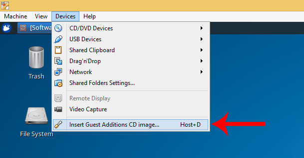

# bap-vm
Virtual Machine for [Best-Answer Prediction seminar]https://github.com/bateman/bap-seminar

## Download VirtualBox
Download the installer and extension pack for your OS from https://www.virtualbox.org/wiki/Downloads

On a Mac with `Homebrew` already installed, simply run the following from terminal (root password will be asked):
```
$ brew tap caskroom/cask
$ brew cask install virtualbox virtualbox-extension-pack
```
## Download the VM image
The Virtual Box image is based on Lubuntu 16.04 LTS Xenial Xerus (64 bit), obtained from [osboxes.org](http://www.osboxes.org/virtualbox-images/). Download the (compressed) VDI image from [here](https://drive.google.com/file/d/0B89FZverAlQVZkdTV3FxdlFfTnc/view?usp=sharing) ([mirror1](https://drive.google.com/file/d/0BysNFCrz-obAUGRnRGdGdFNBVEE/view?usp=sharing)).

### Only for 32 bit host machines!
If your CPU is not able to run a 64 bit guest OS, you'll have instead to download a 32 bit Virtualb Box image from [osboxes.org](http://www.osboxes.org/virtualbox-images/) (or also from [virtualboxes.org](https://virtualboxes.org/images/)). Feel free to pick your distribution of choice, although minor adjustments may be needed as this guide is assumed to work as is with Debian and Ubuntu derivatives. Follow the rest of the guide, then read [this](https://github.com/bateman/bap-seminar) to set up the work enviroment.

## Import VM into VirtualBox

Click `New` to create a new instance for the guest OS, then press the `Expert Mode` button.


The guest OS is a Linux (Lubuntu) 64-bit; make sure to assign at least 2 Gb of memory. Finally, brose the location on your hard-drive where you stored the VDI file.


## Further config

You might want to fine-tune the config for your guest OS according to the host machine. Click on `Settings`. At least, consider enabling bidirectional copy-and-paste between the two OS's, as shown in the picture below.


## Run

Simply click the green arrow `Start` to run the guest OS.


## Other info
Automatic login is set at startup. User credentials are the following:
```
Username: osboxes
Password: osboxes.org
```
These will be necessary for executing administrive (root) changes.

## Guest Additions (optional)

Should your screen size be quite small, it means that you need to install the Guest Additions. Mount the ISO as shown in the picture below. Then, open terminal and browse to the mount location, which will be something like `/media/osboxes/VBOXADDITIONS_5.1.6_110634/` (note that the version may vary).



Now, simply run `sudo ./VBoxLinuxAdditions.run` and reboot the guest OS.

