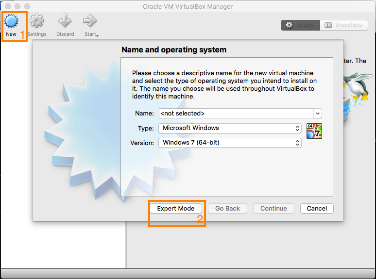
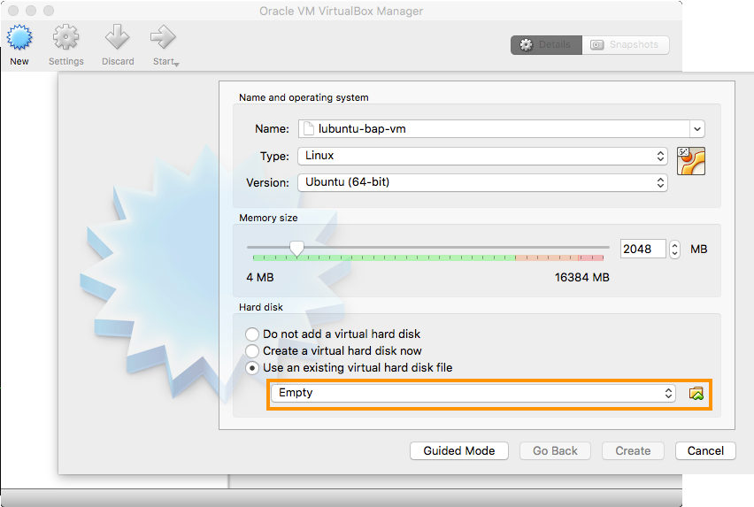
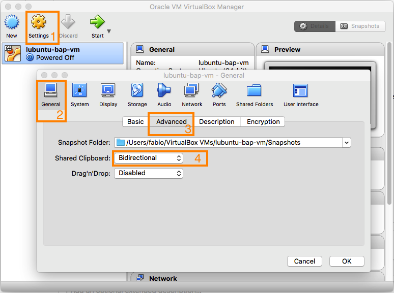

# bap-vm
Virtual Machines for bap-seminar repo

## Download VirtualBox
Download the installer and extension pack for your OS from https://www.virtualbox.org/wiki/Downloads

On a Mac, simply run the following from terminal (root password will be asked):
```
$ brew tap caskroom/cask
$ brew cask install virtualbox virtualbox-extension-pack
```
## Download the VM image
Get the VDI image from [here](./vdi/lubuntu-bap-vm.vdi).

## Import VM into VirtualBox

Click `New` to create a new instance for the guest OS, then press the `Expert Mode` button.


The guest OS is a Linux (Lubuntu) 64-bit; make sure to assign at least 2 Gb of memory. Finally, brose the location on your hard-drive where you stored the VDI file.


## Further config

You might want to fine-tune the config for your guest OS according to the host machine. Click on `Settings`. At least, consider enabling bidirectional copy-and-paste between the two OS's, as shonw in the picture below.


## Run

Simply click the green arrow `Start` to run the guest OS.

## Other info
Automatic login is set at startup. User credentials are the following:
```
Username: osboxes
Passowrd: osboxes.org
```
These will be necessary for executing administrive (root) changes.


